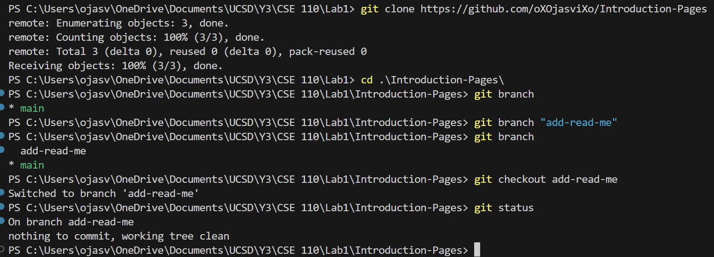

# Ojasvi's Page

## Text section

>Adversity is the first path to truth - G.G. Byron Don Juan

I know it is not what they mean by quote but it is technically valid. :)

I don't know of any **profound** code quotes so I shall just show a *random* piece of code:

```
while(driving){
    goForward()
    dontHit()
}
```
This is a piece of code that shows of how some ~~stupid~~ people think how self driving cars work.

*<sup>This is a joke please dont take it seriously</sup>*


My tenative rankings for languages:
1. Python
2. C++
3. Watermelon

My hobbies:
- Cooking
- Origami
- Gaming

I didn't know what to put for this so I just put a list of chores:
- [x] clean my room
- [ ] do laundry
- [ ] take out trash

## Links section

Here is a link to a very usefule website: [Google](https://www.google.com)

If you wanna look at the text section again here: [Back to text section](#text-section)

Here is a link to the readme if you wanna go there [README](README.md)

## Pics



